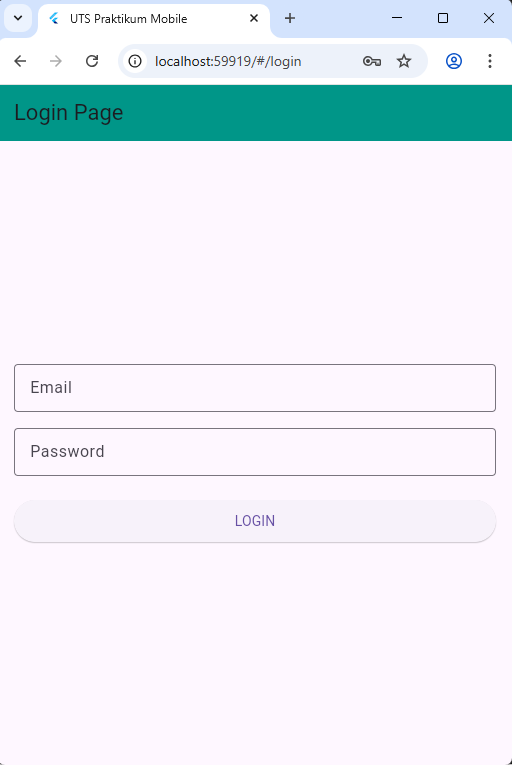
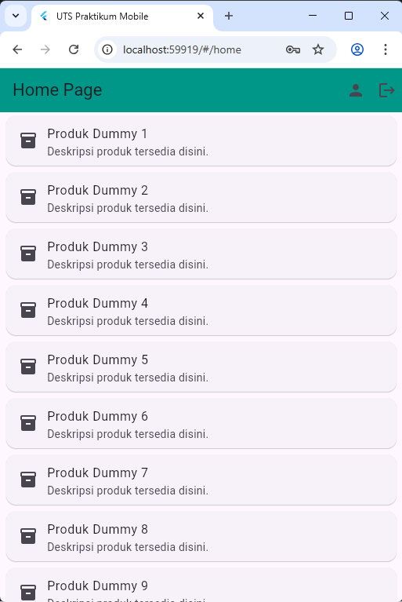
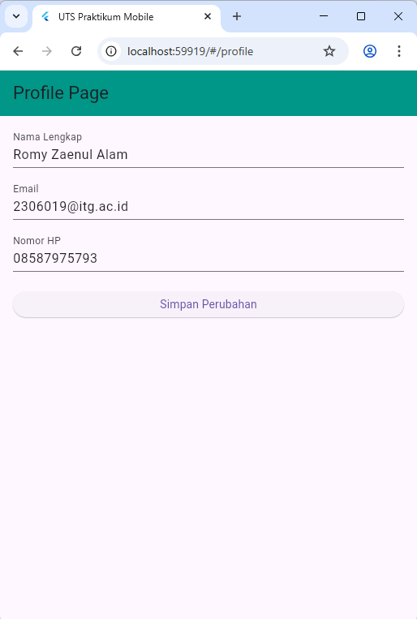

# UTS Praktikum Pemrograman Mobile
**Nama:** Romy Zaenul Alam  
**NPM:** 2306019  
**Kelas:** A Informatika  

## Deskripsi Singkat
Repository ini berisi *source code* aplikasi mobile sederhana yang saya kembangkan untuk memenuhi tugas Ujian Tengah Semester (Take Home Test) mata kuliah Praktikum Pemrograman Mobile. Aplikasi ini dibangun menggunakan framework Flutter, dengan mempraktikkan langsung materi-materi yang ada di Modul 1 sampai Modul 7.

## Fitur Aplikasi
1. **Halaman Login Ter-validasi**
   Form login dibuat menggunakan `TextFormField`. Saya menambahkan pengecekan (validator) agar email harus berformat valid (menggunakan '@') dan password tidak boleh kurang dari 6 karakter.

2. **Routing & Navigasi Antar Halaman**
   Perpindahan halaman dari Login ke Home, hingga ke halaman Profile diatur menggunakan sistem *Named Routes* (`Navigator`) agar lebih rapi dan terstruktur.

3. **Home Page dengan ListView**
   Halaman utama menampilkan daftar data produk *dummy* yang di-render secara dinamis menggunakan `ListView.builder`. Di bagian atas (AppBar), terdapat tombol untuk mengakses halaman profil dan fitur *Logout* untuk kembali ke menu awal.

4. **Profile Page (CRUD Sederhana & State Management)**
   Halaman profil menampilkan detail data *user*. Saya menggunakan `setState` dan menyimpan data pada variabel lokal statis untuk mensimulasikan proses *Read* dan *Update* (CRUD sederhana). Jika form disubmit, data profil akan otomatis diperbarui di layar.

## Screenshot Aplikasi

